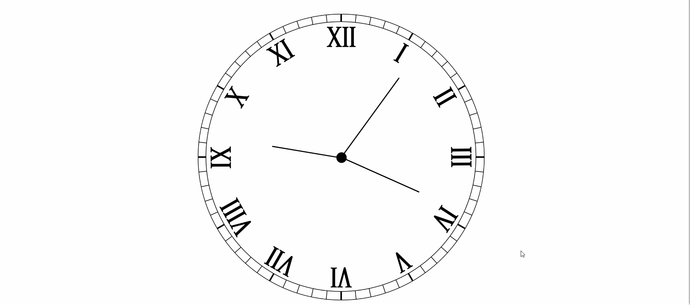

# Clock Project

## It's a simple project based on html, css and javascript

### I use the properties like transform and other through the use of JS. It's fully responsive.

**Sample of the Clock is below.**

